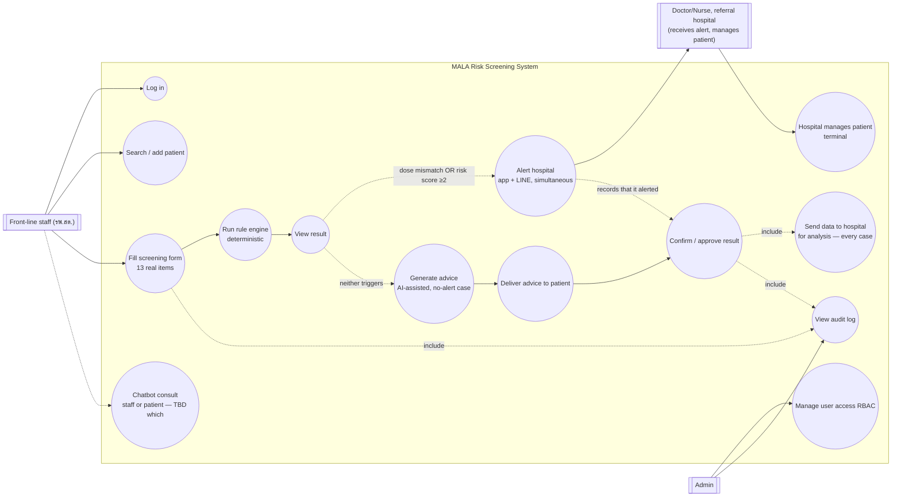
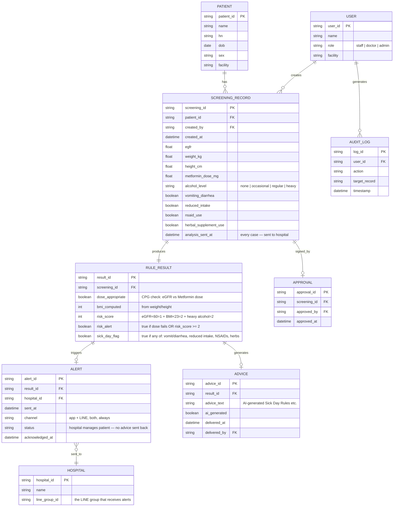
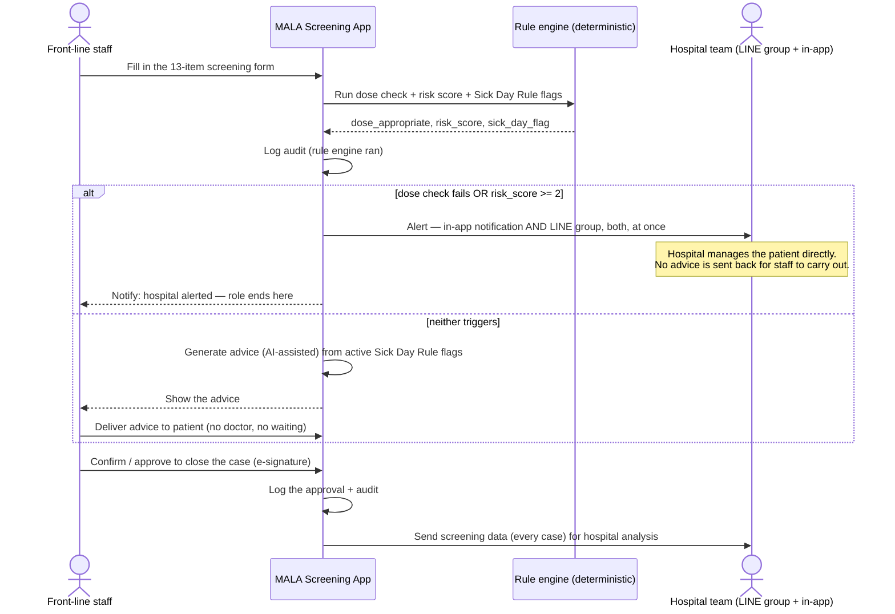
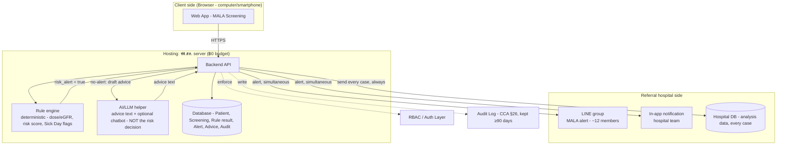

# Diagrams — MALA Risk Screening (4 required for the W5 Gate)

v3 — Sep 8, 2026 · rebuilt around the real clinical criteria in `thresholds/` (DOC-02) — see `../../intent.md` "Real clinical criteria received" and "Confirmed workflow model" for the source of every rule below. An editable draw.io version of these same 4 diagrams lives alongside this file at `mala-diagrams.drawio`.

> **What changed from v2 (same day):** v2 modeled 3 named risk tiers with a doctor-recommendation loop for the lighter two. The real documents that arrived after v2 show a **binary** model instead (alert vs. no-alert), computed by a **deterministic rule engine** (not AI), with alerts going through **both the in-app system and a LINE group**, and AI used only to generate patient advice text (and a possible chatbot) for the no-alert path. Still open, not resolved by this version: reconciling the outline's point-tally scoring against the demo's single 0–100 "Risk Score," and whether the Part 3.0 chatbot is staff-facing or patient-facing — see `../../intent.md`. Do not use this as a final BUILD spec until those close.

## 1. Use-case diagram

## 2. ER diagram

## 3. Sequence diagram — binary alert model

## 4. Architecture diagram

**Note:** the rule engine box is deliberately drawn separate from the AI/LLM box — the alert decision itself is plain deterministic code per `../../intent.md`'s "Risk calculation approach," never a model call. AI is scoped to advice-text generation and the (still-undecided) chatbot only. Not shown: AdminDashboard, HOSxP integration — stretch, out of MVP. See `.docs/01-requirements/backlog.md` for the Stretch section.

## Note
This version is based on `thresholds/` (DOC-02), arrived Sep 8, 2026. Two things are known to be unreconciled inside that same source material — the outline spreadsheet's point-tally scoring vs. the demo deck's single 0–100 Risk Score, and whether Part 3.0's chatbot is staff- or patient-facing — see the open questions in `../../intent.md`. Do not treat this as a final BUILD spec until those close, and until the clinical criteria are formally endorsed (the outline itself is titled "draft").
